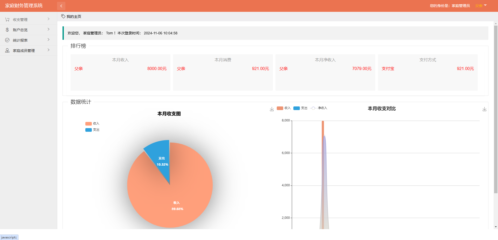
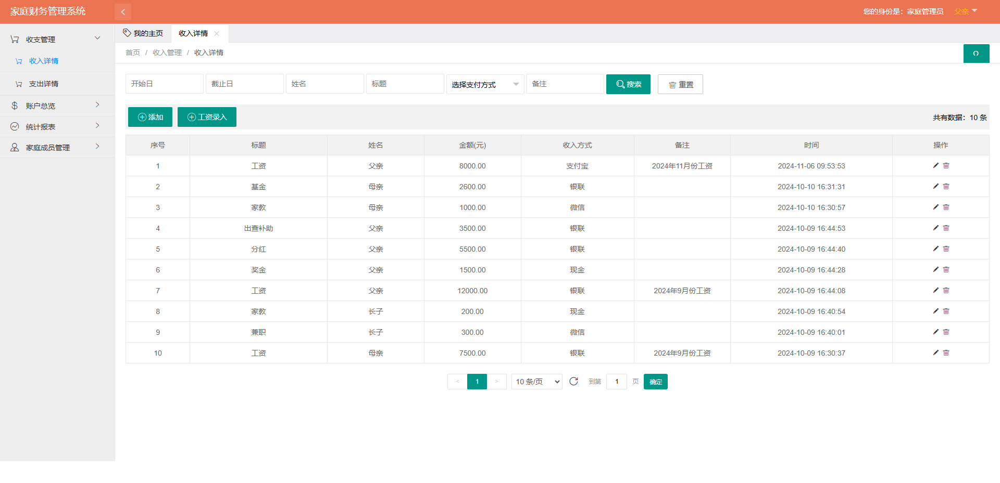
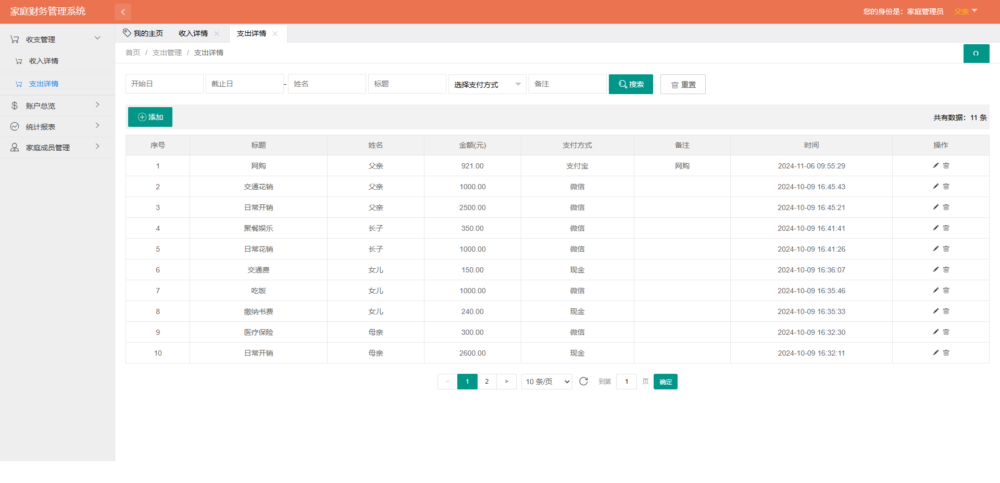
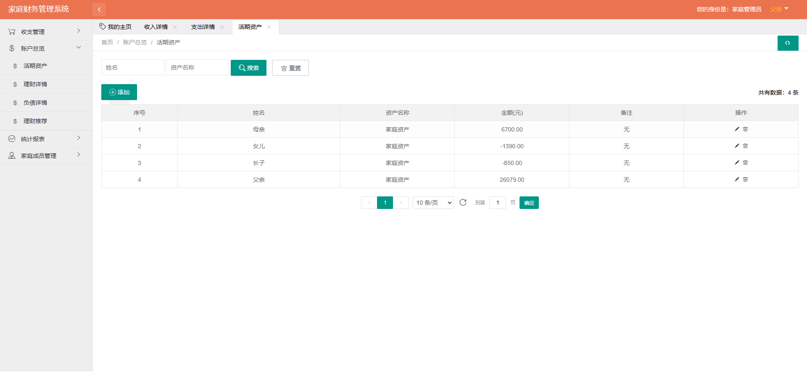
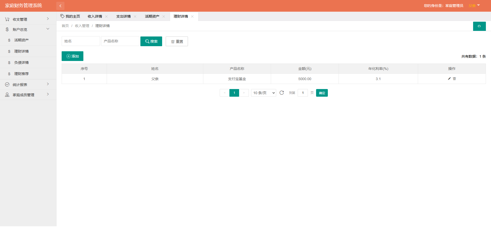
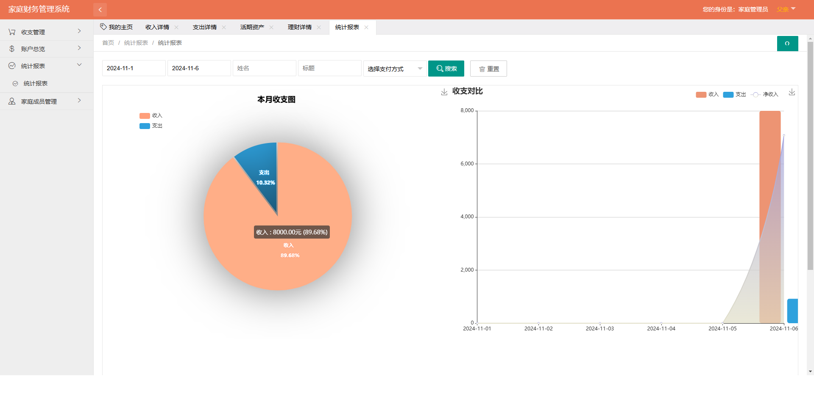
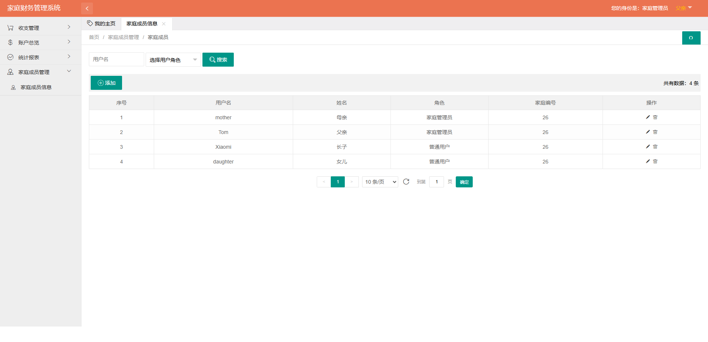
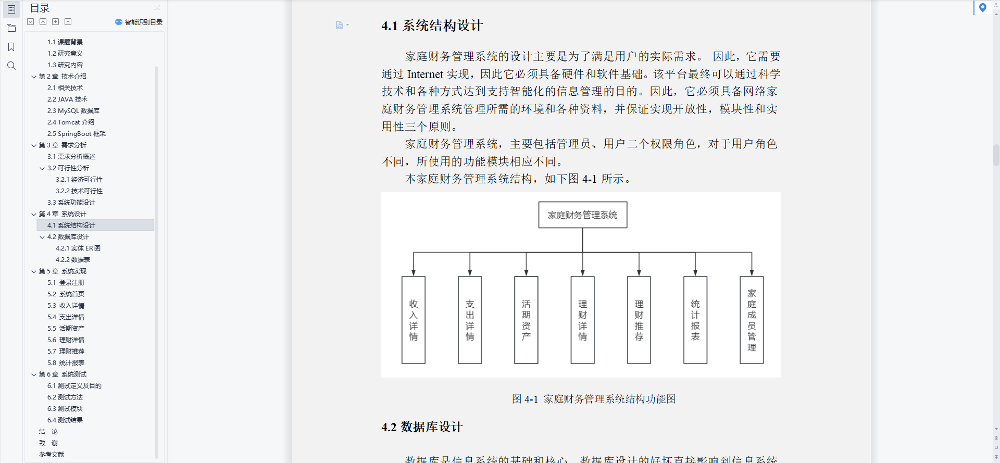
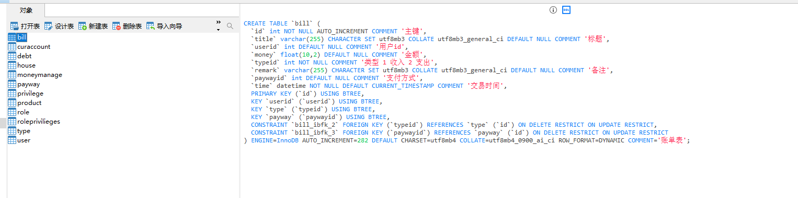

# 1 项目介绍
基于SSM+SpringBoot的家庭理财管理系统：后端 SpringBoot、SSM框架。前端html+JavaScript+Css，具体功能如下：
## 管理端
- 首页统计
- 收入详情
- 支出详情
- 活期资产
- 理财详情
- 负债详情
- 理财推荐
- 统计报表
- 家庭成员管理
# 2 系统运行截图
## 2.1 用户登录

## 2.2 系统首页

## 2.3 收入详情

## 2.4 支出详情

## 2.5 活期资产

## 2.6 理财详情

## 2.7 统计报表

## 2.8 家庭成员管理

## 2.9 万字文档

# 3 数据库设计

# 4 源码数据库获取(收费)

